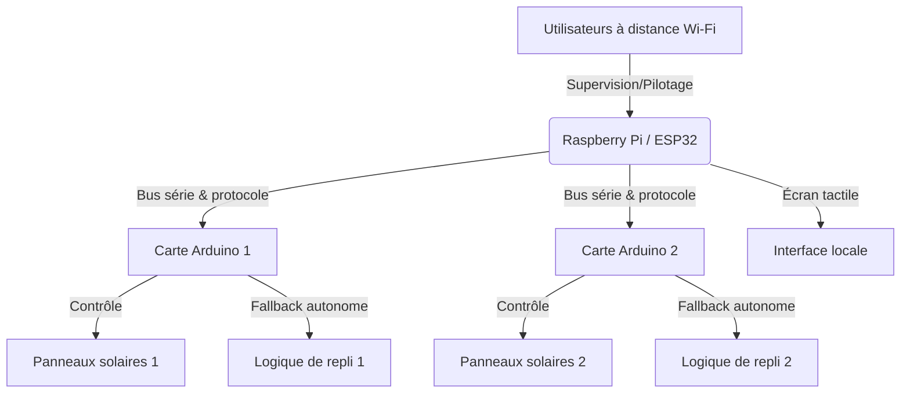

# JO-sun-tracker

## Matériel pour un groupe de panneaux solaire
- 1 carte Arduino UNO (5v)
- 1 module L298N (peut piloter 2 moteurs 12v)
- 2 modules LDR LM393 (photocellule) (prévoir l'étanchéité)
- 1 anémomètre (ref ?)
- 2 boutons poussoir
- 1 bouton switch
- 2 vérins 650mm 12v
- Connecteurs JST
- Têtes de broche compatible UNO
- 1 LED verte
- 1 resistance 220 Ohms
- Wago
- Gaines thermorétractable

## Asservissement, monitoring et pilotage à distance
Dans un second temps, il est prévu d'ajouter une carte de type Raspberry Pi ou ESP32, équipée d'un écran tactile, afin de superviser et piloter le groupe de cartes Arduino via un bus série et un protocole de communication adapté.
Cette évolution permettra également le pilotage et la supervision à distance, nécessitant donc une capacité Wi-Fi sur la carte ajoutée.
Les cartes Arduino devront conserver une logique de repli autonome en cas de dysfonctionnement de cette couche supérieure.




## Programme
Le code source pour la carte Arduino est en cours de développement ici :

[Voir le code source principal](src/driver/main.cpp)

## Mapping des GPIO (Arduino UNO)

```yaml
L298N Motor Driver:
│
├── 10: ─────────────────► ENA: (L298N, PWM motor 1)
├── 8: ──────────────────► IN1: (L298N, motor 1 direction)
├── 9: ──────────────────► IN2: (L298N, motor 1 direction)
│
├── 13: ─────────────────► ENB: (L298N, PWM motor 2)
├── 11: ─────────────────► IN3: (L298N, motor 2 direction)
└── 12: ─────────────────► IN4: (L298N, motor 2 direction)

Mode button:
│
├── 4: ──────────────────► AUTO: (mode auto/manual switch button)

Control buttons - work only in manual mode:
│
├── 2: ──────────────────► RETRACT: (retract button)
└── 3: ──────────────────► DEPLOY: (deploy button)

LDR 1 - sun sensor 1:
|
├── A0: ─────────────────► LDR 1: (analog input)

LDR 2 - sun sensor 2:
|
├── A1: ─────────────────► LDR 2: (analog input)

LDR 3 - night sensor:
|
├── A2: ─────────────────► LDR 3: (analog input)
```
