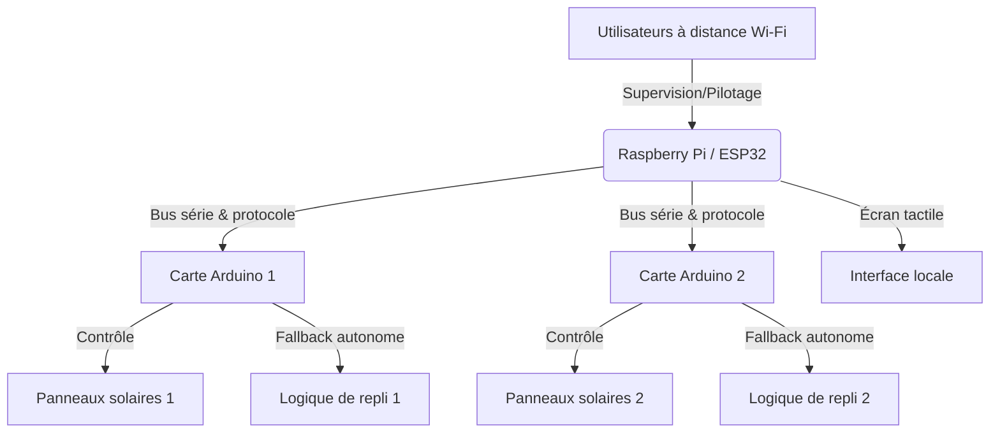

# JO-sun-tracker

## Matériel pour un groupe de panneaux solaire
- 1 carte ESP32 Dev Module ou Arduino UNO\NANO
- 1 shield screw bornier pour ESP32 ou UNO\NANO
- 1 module L298N (peut piloter 2 moteurs 12v)
- 2 modules LDR LM393 (photocellule) (prévoir l'étanchéité)
- 1 anémomètre (ref ?)
- 3 boutons poussoir
- 1 bouton switch
- 2 vérins 650mm 12v
- Connecteurs JST
- 1 LED verte
- 1 resistance 220 Ohms
- Wago
- Gaines thermorétractable

## Asservissement, monitoring et pilotage à distance
Dans un second temps, il est prévu d'ajouter une carte de type Raspberry Pi ou ESP32, équipée d'un écran tactile, afin de superviser et piloter le groupe de cartes Arduino via un bus série et un protocole de communication adapté.
Cette évolution permettra également le pilotage et la supervision à distance, nécessitant donc une capacité Wi-Fi sur la carte ajoutée.
Les cartes Arduino devront conserver une logique de repli autonome en cas de dysfonctionnement de cette couche supérieure.

## Programme
Le code source est en cours de développement ici :

[Voir le code source principal](src/driver/driver.ino)

## Prérequis logiciels

- **Arduino IDE**
  [Télécharger l’Arduino IDE](https://www.arduino.cc/en/software)

- **Bibliothèques à installer via le Library Manager de l’IDE Arduino** :
  - **ArduinoLog** (Thijs Elenbaas)  
    (Outils → Gérer les bibliothèques… → Rechercher « ArduinoLog » → Installer)
  - **FIR-Filter** (Thomas Kaufmann)  
    (Outils → Gérer les bibliothèques… → Rechercher « FIR-Filter » → Installer)
  - **dv_led_blink** (David Vandensteen)  
    (Outils → Gérer les bibliothèques… → Rechercher « dv_led_blink » → Installer)

## Scénarios de test (montage + code)
- [Fonctionnement basique du L298N](tests/L298N/01-basic)
- [Client WIFI basique sur ESP32](tests/wifi)
- [Serveur http sur ESP32](tests/http-server)

