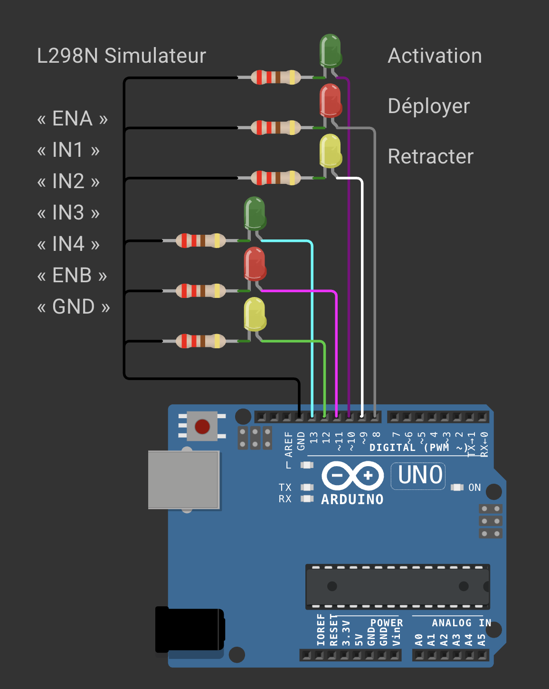

# Test basique du module L298N avec Arduino UNO

Ce test permet de vérifier le fonctionnement du module L298N en le pilotant avec une carte Arduino UNO.

## Objectif
- Allumer différentes LEDs pour simuler les états de commande du module L298N
- Préparer le code de gestion pour le contrôle de moteurs ou vérins via le L298N.

## Schéma de câblage
- L'image ci-dessus (wiring.png) montre le câblage utilisé pour ce test.

