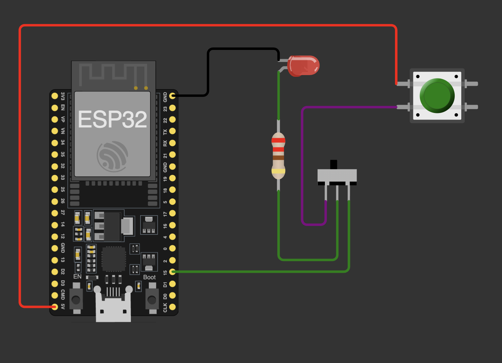

# Manual Command Isolation - 01

Schema de cablage :

## A quoi sert ce montage

Ce montage sert a tester une commande manuelle avec isolation entre :
- la sortie GPIO de l'ESP32
- une commande externe par bouton

L'idee est de pouvoir piloter la meme charge (la LED de test) soit par le microcontroleur, soit manuellement, sans mettre en conflit electrique les deux sources de commande.

## Fonctionnement

- GPIO15 de l'ESP32 : sortie de commande (clignotement dans le sketch de test)
- Resistance 220 ohms + LED : charge de test visuelle
- Bouton poussoir : commande manuelle qui envoie VCC (issu de l'ESP32 alimente en USB)
- Interrupteur coulissant : selection de la source de commande

Selon la position de l'interrupteur :
1. Mode ESP32 : la LED suit l'etat du GPIO15.
2. Mode manuel : la LED suit l'appui sur le bouton.

## Pourquoi c'est utile

- Evite de relier directement la sortie GPIO a une autre source de tension.
- Permet un mode secours/maintenance meme si le code ne repond pas.
- Valide le principe de bypass manuel avant integration sur le systeme final.

## Point d'attention alimentation

Dans cette version du test, l'ESP32 est alimente uniquement par USB.

Ne pas reconnecter une alimentation 5 V externe en parallele de l'USB. Garder une seule source d'alimentation a la fois pour eviter les retours de courant, les instabilites et les risques de dommage materiel.

## Fichiers associes

- Simulation Wokwi : [wokwi/diagram.json](wokwi/diagram.json)
- Sketch de test : [wokwi/sketch.ino](wokwi/sketch.ino)
