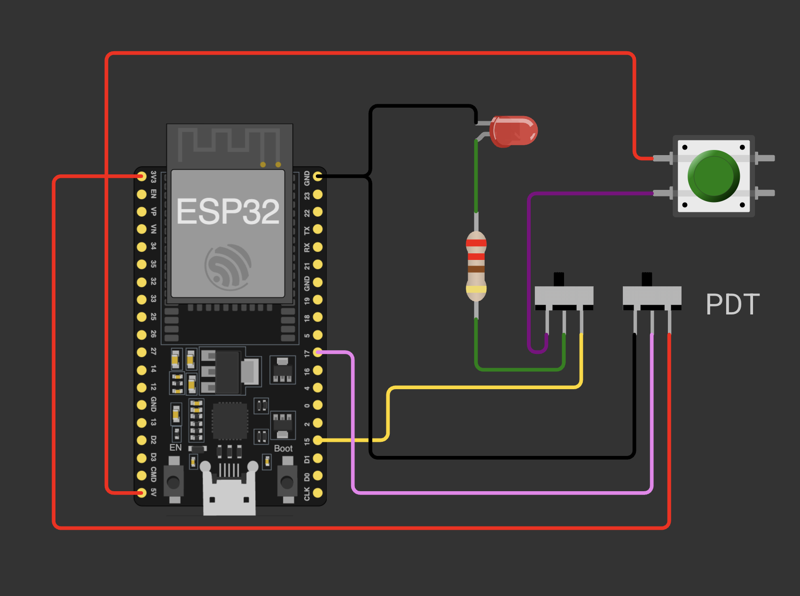

# Manual Command Isolation - 02

## Schema de cablage

## Objectif

Ce montage valide une commande manuelle avec isolation sur deux points :
- la source qui pilote la charge (LED),
- la source qui pilote une entree logique de l'ESP32.

Le but est de pouvoir basculer entre mode automatique (ESP32) et mode manuel, sans mettre en conflit des sorties entre elles, avec une alimentation unique via l'USB de l'ESP32.

## Composants

- 1 ESP32 DevKit
- 1 bouton poussoir
- 1 LED + 1 resistance 220 ohms
- 2 interrupteurs coulissants (SPDT)
- alimentation USB de l'ESP32 (source unique)

## Fonctionnement du montage

### 1) Selection de la commande de la LED (interrupteur de gauche)

- Le point commun de l'interrupteur alimente la branche LED + resistance.
- Une position relie la LED au GPIO15 (commande par firmware).
- L'autre position relie la LED au bouton (commande manuelle depuis VCC).

Resultat : la LED peut etre pilotee soit par l'ESP32, soit par le bouton, sans liaison directe entre GPIO15 et la ligne du bouton.

### 2) Selection de l'etat d'entree sur GPIO17 (interrupteur de droite)

- Le point commun de l'interrupteur est relie a GPIO17.
- Une position force GPIO17 a 3V3.
- L'autre position force GPIO17 a GND.

Resultat : on injecte un niveau logique stable (HIGH ou LOW) sur l'entree, pratique pour tester les changements d'etat logiciel.

## Point d'attention materiel reel

Sur le montage final, les selections ne seront pas faites avec deux interrupteurs separes comme sur ce schema de test. Un seul interrupteur multi-pole sera utilise pour realiser les deux bascules en meme temps.

## Pourquoi ce test est utile

- Valide un principe de bypass manuel en securite.
- Evite les retours de courant entre deux sources de commande.
- Permet de tester separement la commande de sortie et la lecture d'entree.
- Facilite la mise au point firmware avant integration mecanique finale.

## Point d'attention alimentation

Dans cette version simplifiee, l'ESP32 est alimente uniquement par USB.

Ne pas ajouter une alimentation 5 V externe en parallele de l'USB. Garder une seule source d'alimentation a la fois pour eviter les retours de courant, les instabilites et les risques de dommage materiel.

## Verification rapide

1. Basculer l'interrupteur gauche en mode GPIO15 et verifier la LED selon le sketch.
2. Basculer en mode bouton et verifier que la LED reagit uniquement a l'appui.
3. Basculer l'interrupteur droit et verifier que GPIO17 change bien entre HIGH et LOW dans le code.

## Fichier associe

- Simulation Wokwi : [wokwi/diagram.json](wokwi/diagram.json)
- Sketch de test : [wokwi/sketch.ino](wokwi/sketch.ino)
