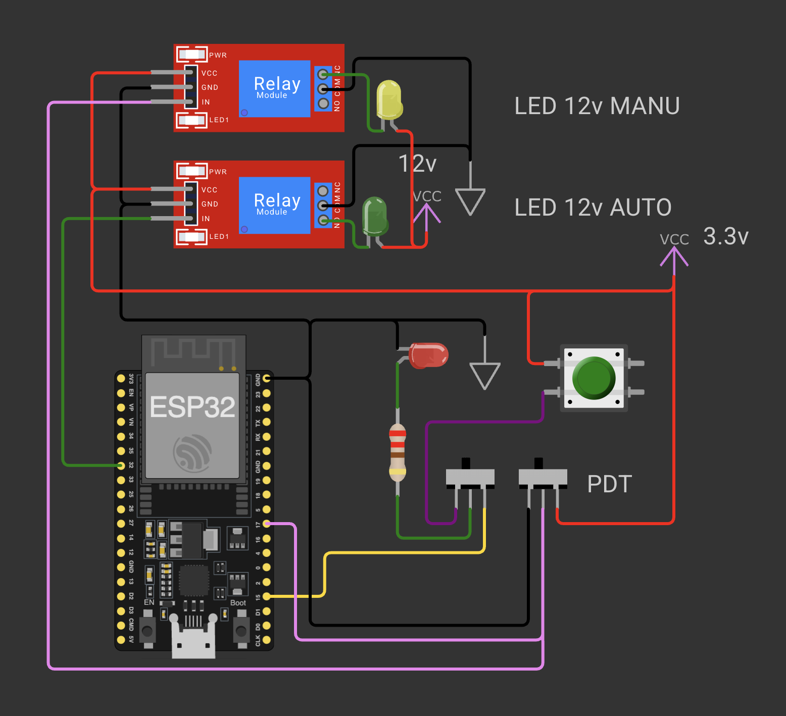

# Manual Command Isolation - 03

## Schema de cablage

## Objectif

Ce montage valide un mode AUTO/MANU avec isolation de commande :
- une sortie locale de test sur LED (GPIO15),
- une entree de selection de mode (GPIO17),
- et la commande de deux relais qui pilotent deux charges 12 V distinctes.

Le but est de verifier qu'un meme systeme peut basculer proprement entre mode automatique et mode manuel, sans conflit entre sources de commande.

## Composants

- 1 ESP32 DevKit (alimente en USB)
- 1 bouton poussoir
- 1 LED rouge + 1 resistance 220 ohms (test local)
- 2 modules relais 1 canal
- 2 LED de test cote 12 V (AUTO et MANU)
- 2 interrupteurs coulissants SPDT (representation de test)

## Fonctionnement du montage

### 1) Sortie locale de validation (GPIO15)

- Le GPIO15 pilote une LED rouge via resistance 220 ohms.
- Un interrupteur permet de choisir la source de commande de cette LED :
1. position GPIO15 (commande firmware),
2. position bouton (commande manuelle depuis 3.3 V).

### 2) Selection du mode via entree GPIO17

- Un second interrupteur force GPIO17 a HIGH (3.3 V) ou LOW (GND).
- Le sketch lit GPIO17 pour choisir le mode :
1. GPIO17 LOW -> MODE MANU,
2. GPIO17 HIGH -> MODE AUTO.

### 3) Pilotage des relais et charges 12 V

- GPIO32 commande le relais AUTO.
- GPIO17 (via la selection de mode) commande le relais MANU.
- Chaque relais commute une charge LED 12 V differente (LED 12V AUTO et LED 12V MANU).

## Logique logicielle (sketch)

Le sketch effectue les actions suivantes :
- lit GPIO17,
- affiche MODE AUTO ou MODE MANU sur le port serie,
- met GPIO32 a HIGH en AUTO et a LOW en MANU,
- continue le clignotement de la LED locale sur GPIO15.

## Point d'attention materiel reel

Le schema montre deux interrupteurs SPDT pour rendre la simulation lisible. Sur le montage reel, ces bascules peuvent etre regroupees dans un seul interrupteur multi-pole.

## Point d'attention alimentation

- ESP32 : alimentation USB uniquement.
- Ne pas ajouter une seconde alimentation 5 V en parallele sur la carte.

Une double alimentation (USB + 5 V externe) peut provoquer des retours de courant, des instabilites et des risques de dommage materiel.

## Verification rapide

1. Mettre GPIO17 a HIGH : verifier l'affichage MODE AUTO et la reaction de la sortie relais AUTO.
2. Mettre GPIO17 a LOW : verifier l'affichage MODE MANU et la reaction de la sortie relais MANU.
3. Basculer la commande de LED locale entre GPIO15 et bouton pour valider l'isolation de commande.
4. Verifier que les LED 12 V AUTO et MANU ne s'allument pas en meme temps.

## Fichiers associes

- Simulation Wokwi : [wokwi/diagram.json](wokwi/diagram.json)
- Sketch de test : [wokwi/sketch.ino](wokwi/sketch.ino)
