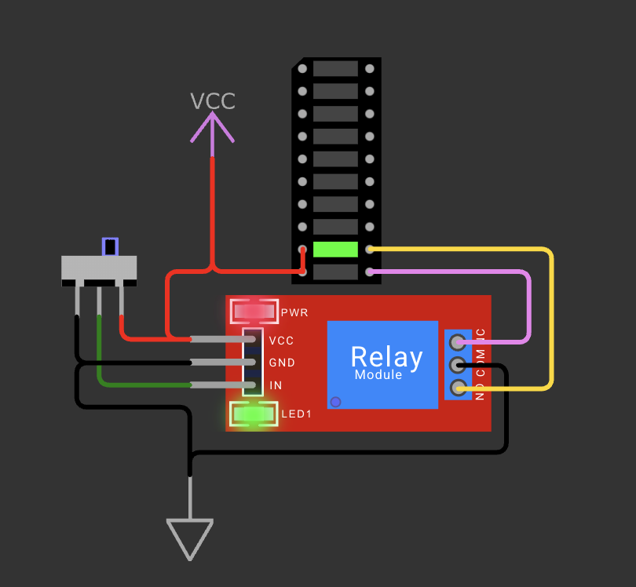

# Relay Test - 01

## Schema de cablage

## Objectif

Ce test valide le fonctionnement d'un module relais 1 canal, en verifiant la commutation entre les contacts NC et NO selon l'etat de l'entree IN.

## Composants utilises

- 1 module relais (VCC, GND, IN, COM, NC, NO)
- 1 interrupteur coulissant (selection de l'etat logique de IN)
- 1 barre LED (utilisee comme charge de test)
- Alimentation VCC/GND

## Cablage

- Alimentation du relais :
  - VCC -> VCC
  - GND -> GND
- Commande :
  - IN du relais relie au curseur de l'interrupteur
  - Une position de l'interrupteur vers VCC
  - L'autre position de l'interrupteur vers GND
- Contacts de puissance :
  - COM relie au GND
  - NC et NO relies a deux entrees de la barre LED
  - Le cote oppose de la barre LED relie au VCC

## Principe de fonctionnement

Le relais connecte COM vers un seul contact a la fois :

1. Relais au repos : COM est connecte a NC.
2. Relais active : COM est connecte a NO.

Comme COM est au GND et la barre LED est alimentee en VCC, le contact actif (NC ou NO) devient un retour vers la masse. La LED correspondant a ce contact s'allume.

## Ce que ce test permet de verifier

- Le module relais commute bien entre NC et NO.
- L'entree IN est correctement pilotee par un niveau haut/bas.
- Le cablage des contacts COM/NC/NO est correct.

## Fichier associe

- Simulation Wokwi : [wokwi/diagram.json](wokwi/diagram.json)
