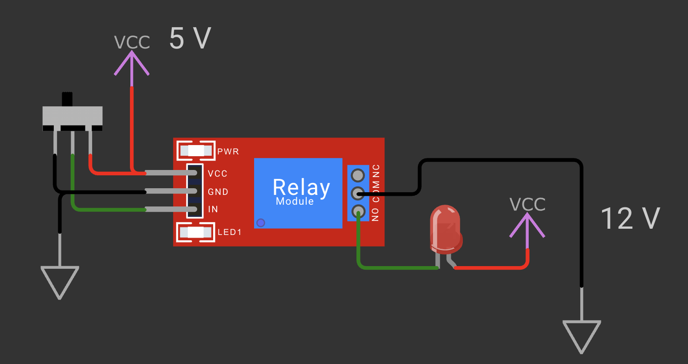

# Relay Test - 02

## Schema de cablage

## Objectif

Ce montage teste un module relais en situation de commande simple :
- la partie commande du relais est alimentee en 5 V
- la charge de test est alimentee en 12 V
- l'interrupteur coulissant choisit l'etat de l'entree IN du relais

Le but est de verifier que le relais peut commander une charge 12 V sans liaison directe entre la commande 5 V et la charge.

## Principe

Le module relais est pilote par son entree IN.
Selon la position de l'interrupteur :
- IN est mis au niveau haut
- ou IN est mis au niveau bas

Le contact COM du relais est relie a la masse du circuit 12 V.
Le contact NO est relie a la cathode de la LED.
L'anode de la LED est reliee au 12 V.

Quand le relais commute vers NO, le retour a la masse est ferme et la LED s'allume.
Quand le relais revient au repos, le circuit est ouvert et la LED s'eteint.

## Ce que ce test permet de valider

- le fonctionnement du module relais en 5 V
- la separation entre commande et puissance
- la commutation du contact NO
- l'alimentation d'une charge externe en 12 V

## Composants utilises

- 1 module relais
- 1 interrupteur coulissant
- 1 LED de test
- 1 alimentation logique 5 V
- 1 alimentation de charge 12 V

## Fichier associe

- Simulation Wokwi : [wokwi/diagram.json](wokwi/diagram.json)
